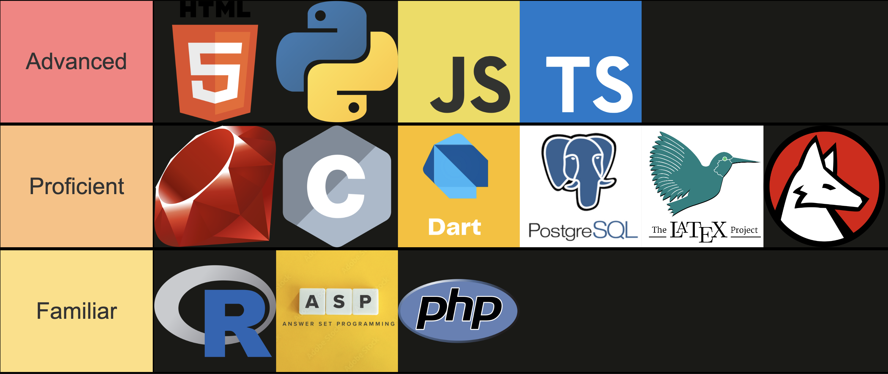

### Hi there 👋

- 🔭 Currently on an academic exchange @ [The University of Manchester](https://www.manchester.ac.uk/) 
- 💻 BEng CS & EEE @ [Pontificia Universidad Católica](https://www.manchester.ac.uk/) 🇨🇱
- 📫 sebaterrazas@uc.cl
- ℹ️ For more info (like my portfolio) click the GOAT [ info](sebaterrazas.github.io)

# About Me

## Who am I?
As a Brazilian 🇧🇷 born, Chilean 🇨🇱 raised individual, I have always been drawn to challenges and using my skills for problem-solving. This is likely why I have always had a passion for the field of engineering and computer science.

My hobbies are watching/playing football ⚽️ and video games 🎮, and coding 💻. I also enjoy reading books 📚, having read some classics like the Harry Potter series, some Jules Verne novels, and A Game of Thrones.

## My Skills

### Languages

Currently learning Rust ⏳

### Technologies
The technologies I have used for my projects are:
- React
- React Native
- NodeJS
- Flutter
- Ruby on Rails
- Angular
- WordPress
- Firebase / Google Cloud
- Azure
- Docker
- Clingo
- OpenAI

Currently learning Apache Spark, Next.js, and Supabase ⏳

### AI
- AI Algorithms
- Machine Learning
- Deep Learning
- Oobabooga
- Fine-tuning
- Prompt Engineering

